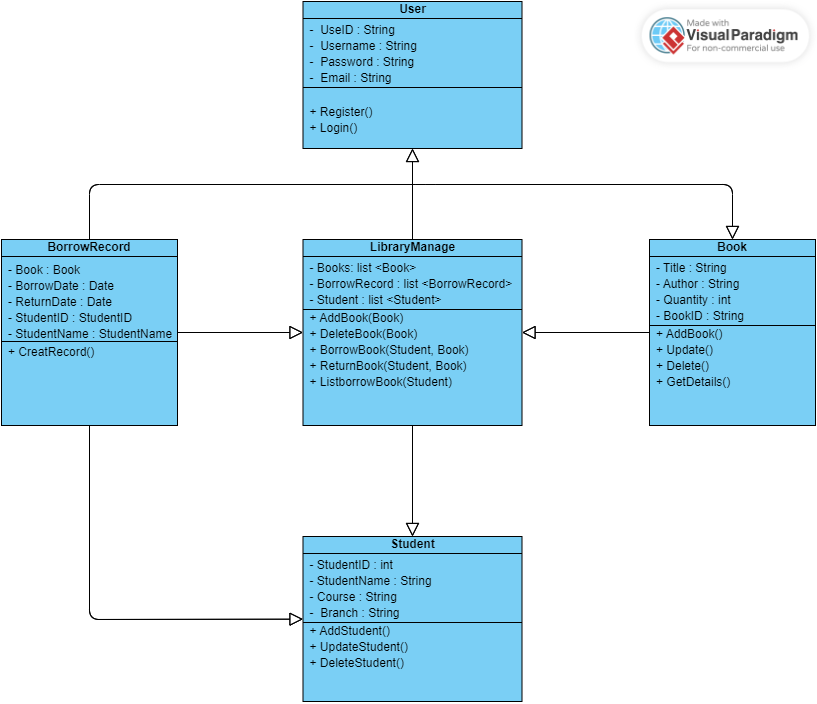
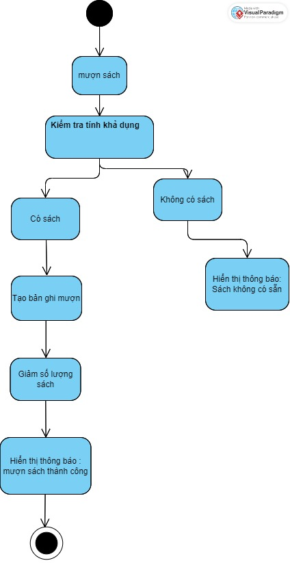
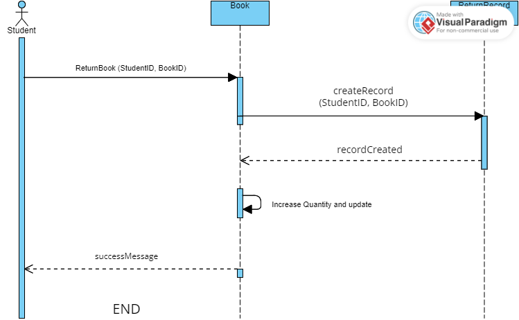
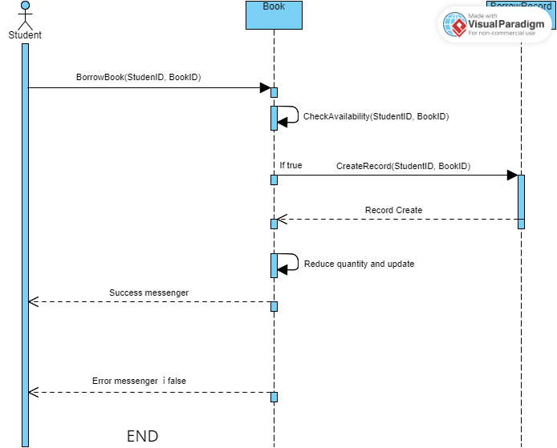
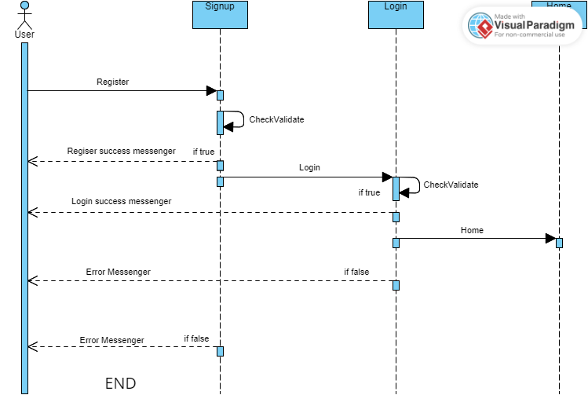
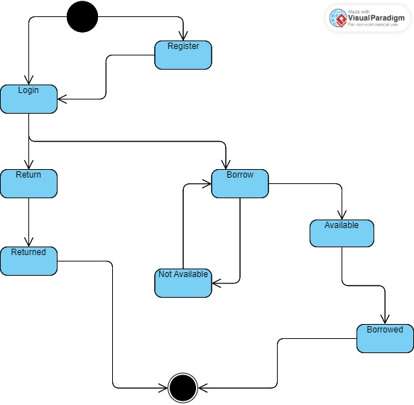
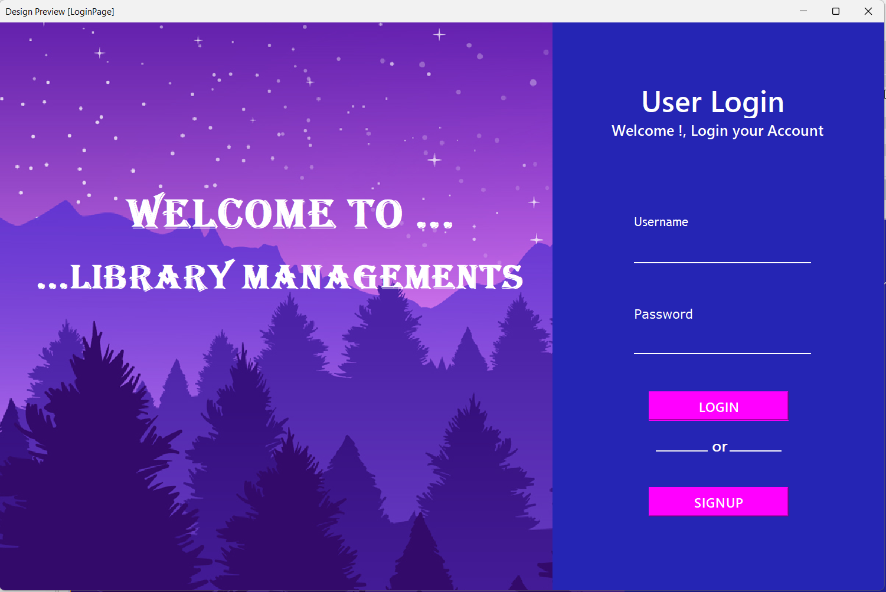
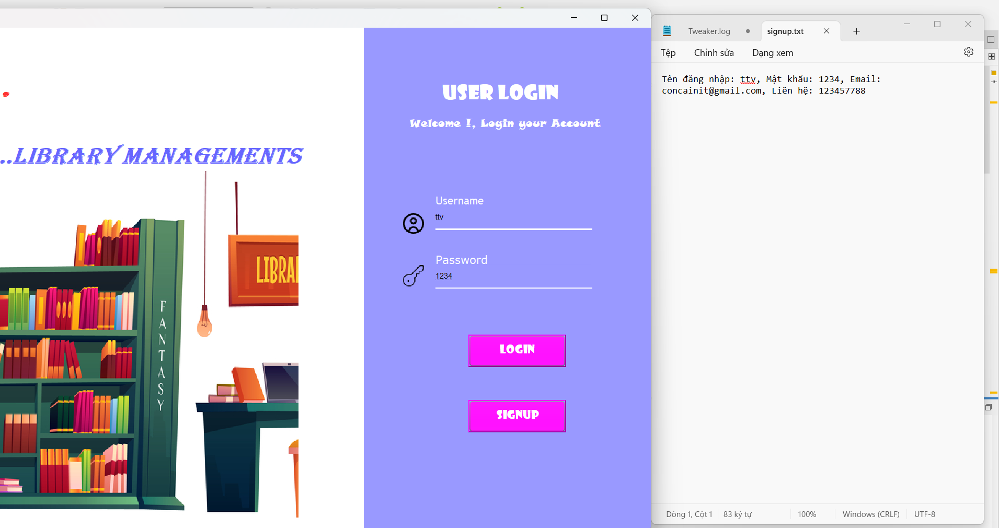

# Hệ Thống quản lí thư viện

## Giới Thiệu Dự Án
Đây là dự án quản lí thư viện cho phép sinh viên mượn trả tài liệu.
## Thành Viên Nhóm
- **Vũ Hữu Lưu** : Phát triển phần mềm
- **Nguyễn Minh Đức** : Phát triển phần mềm

## Các Chức Năng  
  - Có chức năng quản lý sách, tài liệu:  
    + Thêm, sửa, xóa sách, tài liệu và số lượng.  
    + Liệt kê thông sách, tài liệu; Số lượng tồn; Người đang mượn, ….  
  - Có chức năng mượn sách, trả sách

## UML Diagram

## 1.1 UML Class Diagram

## 1.2 UML Activity Diagram

## 1.3 UML Sequence 

## 1.3.1 Return Book

## 1.3.2 Borrow Book

## 1.3.3 Signup and Login

## 1.4 UML State Diagram

## 1.5 First View Of The Project

## 1.6 Write To File

